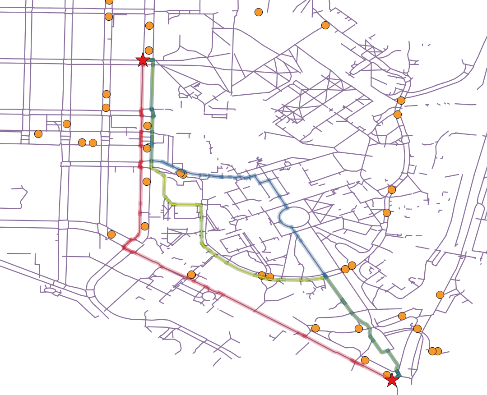

# access-map

This explores pedestrian routes between two bus stops with different cost functions using Open Street Map data and pgRouting. The ultimate goal is to improve the transfer experience for transit users with various mobility constraints.

The sql files are for use with a postgreSQL database loaded with OSM data using osm2pgrouting. They have been hardcoded with a start and end location. In this case, two bus stops in the University District in Seattle, WA.

## Routes
The example finds four pedestrian routes based on costs related to having to cross a street and the type of crossing. The first route (red, below) finds the shortest route. The second route (blue, below) finds the shortest route with an additional penalty for crossing the street. The third route (green, below) finds the shortest route with additional penalties for crossing the street and if the crosswalk is uncontrolled (ie no signal). The fourth route finds the shortest route with additional penalties for crossing the street and if the crosswalk is uncontrolled (ie no signal) or unmarked. 

## Map
Example output comparing the routes is visualized in QGIS:   
Start: 15th and 42nd, Seattle WA  
End: Pacific and Montlake, Seattle WA  
Bus stops are shown in orange circles, sidewalks are purple and routes are colored as outlined above.   

